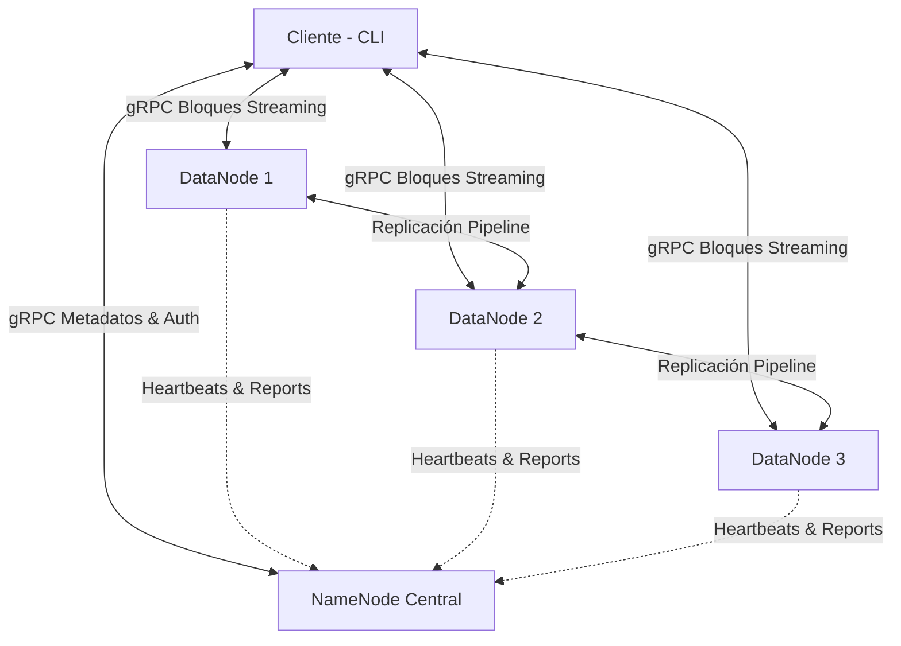

# Proyecto DFS: Sistema de Archivos Distribuido por Bloques (MiniDFS)

Este repositorio contiene la implementación de un **Sistema de Archivos Distribuido (DFS) minimalista por bloques** diseñado para la asignatura de **Arquitecturas de Nube y Sistemas Distribuidos** (Proyecto - 20%).

## 🎯 Objetivo General
Diseñar e implementar un DFS minimalista que permita almacenar y acceder a archivos grandes de forma distribuida en múltiples nodos, aplicando particionamiento en bloques y replicación. El sistema consta de un **NameNode** central que gestiona los metadatos y la ubicación de los bloques, múltiples **DataNodes** que almacenan los bloques de datos con tolerancia a fallos, y un **Cliente interactivo (CLI)**.

---

## 🏛️ Arquitectura del Sistema

El sistema sigue una arquitectura descentralizada en el almacenamiento pero centralizada en la gestión de metadatos:



### Componentes Principales:
1. **NameNode**: 
   - **Base de Datos SQLite**: Almacena de forma persistente usuarios (con hash de contraseñas mediante `bcrypt`), archivos, directorios, bloques, ubicaciones físicas de los bloques y estado de los DataNodes.
   - **Auth Service**: Autenticación segura mediante JSON Web Tokens (JWT).
   - **Namespace Manager**: Sistema de archivos jerárquico virtual que permite operaciones como `mkdir`, `rmdir`, `ls` y `rm` por usuario.
   - **Block Manager**: Asignación inteligente de bloques a DataNodes usando Round-Robin balanceado.
   - **Heartbeat Monitor**: Daemon en segundo plano que detecta fallos en DataNodes en tiempo real y gestiona la re-replicación.

2. **DataNode**:
   - **Block Store**: Almacenamiento físico de bloques en disco con verificación de integridad mediante hashes SHA-256.
   - **Heartbeat Agent**: Envío periódico de señales de vida al NameNode.
   - **Block Report Agent**: Reportes periódicos del inventario de bloques almacenados físicamente.
   - **Replication Pipeline**: Replicación en tubería (pipeline) de bloques entre nodos de datos para asegurar el factor de replicación.

3. **Cliente CLI**:
   - Comandos interactivos de autenticación (`register`, `login`, `logout`).
   - Comandos del sistema de archivos (`ls`, `mkdir`, `rmdir`, `rm`).
   - Operaciones de carga y descarga de archivos (`put` y `get`) con división automática de bloques (64MB) y reensamblado en el destino.

---

## 📅 Cronograma de Implementación (3 Días)

### **Día 1: Cimientos e Infraestructura** (¡Completado! ✅)
- [x] Definición del contrato de comunicación en `proto/dfs.proto` y generación de stubs gRPC.
- [x] Configuración centralizada vía variables de entorno (`config.py`).
- [x] Capa de persistencia SQLite completa para NameNode (`metadata_store.py`).
- [x] Servicio de autenticación JWT segura con encriptación `bcrypt`.
- [x] Gestor de espacio de nombres jerárquico virtual (`namespace_manager.py`).
- [x] Daemon de monitoreo de latidos en NameNode (`heartbeat_monitor.py`).
- [x] Servidor gRPC NameNode completo (esqueletos funcionales de todos los RPCs).
- [x] Agentes de Heartbeat y Block Report en DataNode.
- [x] Estructura de almacenamiento local `BlockStore` con hashes SHA-256 en DataNode.
- [x] Cliente interactivo CLI básico (autenticación y navegación virtual completadas).
- [x] Orquestación base con Docker Compose (1 NameNode + 3 DataNodes) y Dockerfiles.

### **Día 2: Operaciones Core (PUT, GET y Pipeline)** (En progreso ⏳)
- [ ] Implementación de división de archivos en bloques de 64MB y reensamblado.
- [ ] Transferencia gRPC en streaming de bloques con tolerancia a fallos transitorios (Backoff exponencial).
- [ ] Lógica de replicación real en Pipeline entre DataNodes.
- [ ] Comandos CLI `put` y `get` completamente operativos de extremo a extremo.

### **Día 3: Tolerancia a Fallos, Despliegue y Pruebas** (Pendiente ⏳)
- [ ] Detección real de corrupción de bloques (SHA-256 mismatch) y auto-sanación.
- [ ] Proceso automático de re-replicación activa cuando cae un DataNode.
- [ ] Suite de pruebas de estrés y script de simulación de fallos.
- [ ] Guía de despliegue en AWS EC2 utilizando Docker.

---

## 🛠️ Estructura del Proyecto

```text
Proyecto DFS/
├── proto/               # Definición y stubs gRPC
│   ├── dfs.proto        # Contrato de comunicación
│   ├── dfs_pb2.py       # Stubs de mensajes compilados
│   └── dfs_pb2_grpc.py  # Stubs de servicios compilados
├── namenode/            # Lógica del NameNode central
│   ├── auth_service.py  # Autenticación JWT
│   ├── block_manager.py # Algoritmos de distribución de bloques
│   ├── heartbeat_monitor.py  # Daemon de monitoreo de DataNodes
│   ├── metadata_store.py# Capa de base de datos SQLite
│   ├── namespace_manager.py  # Sistema de archivos jerárquico
│   ├── server.py        # Servidor gRPC principal
│   └── Dockerfile       # Contenedor para NameNode
├── datanode/            # Lógica de los Nodos de Datos
│   ├── block_store.py   # Almacenamiento local e integridad (SHA-256)
│   ├── heartbeat_agent.py    # Envío de latidos
│   ├── block_report_agent.py # Reporte de inventario de bloques
│   ├── replication_agent.py  # Replicación entre nodos
│   ├── server.py        # Servidor gRPC del DataNode
│   └── Dockerfile       # Contenedor para DataNode
├── client/              # Lógica del Cliente CLI
│   ├── cli.py           # Interfaz de línea de comandos interactiva
│   ├── auth_client.py   # Almacenamiento seguro de tokens locales
│   ├── block_splitter.py# Divisor de archivos en bloques
│   ├── block_assembler.py    # Reconstructor de archivos
│   └── block_transfer.py# Operaciones gRPC streaming de subida/bajada
├── docker-compose.yml   # Orquestación de red y contenedores locales
├── .env.example         # Plantilla de variables de entorno
└── README.md            # Documentación general del proyecto
```

---

## ⚡ Cómo Empezar (Prueba de Concepto - Día 1)

1. **Requisitos previos**:
   - Python 3.10+
   - Pip

2. **Instalar dependencias**:
   ```bash
   pip install grpcio grpcio-tools cryptography pyjwt bcrypt
   ```

3. **Iniciar el NameNode**:
   ```bash
   python namenode/server.py
   ```

4. **Iniciar un DataNode**:
   ```bash
   python datanode/server.py
   ```

5. **Ejecutar el Cliente CLI**:
   ```bash
   python client/cli.py
   ```

*(Nota: En los días 2 y 3 se habilitará el despliegue multi-nodo automatizado con Docker Compose y las pruebas automatizadas).*
